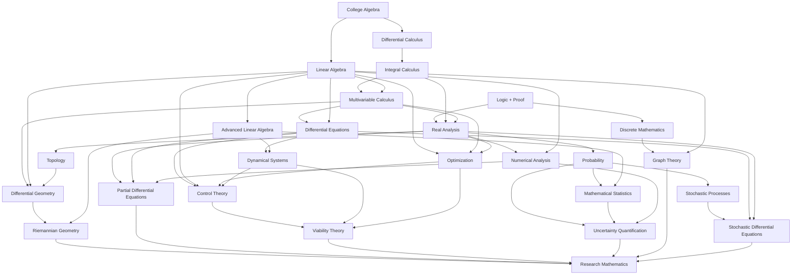

# Mathematics Dependency Graph — MDG-001

**Status:** `PROPOSED_ACTIVE_REVIEW`

The dependency graph is a directed acyclic knowledge graph. An arrow `A → B` means **A supplies a prerequisite structure materially used by B**. It does not imply that every topic in A must be completed before any topic in B begins.



## Dependency semantics

Every dependency edge must eventually be classified as one of:

| Edge type | Meaning |
|---|---|
| `DEFINITIONAL` | downstream object requires upstream definitions |
| `THEORETICAL` | downstream theorem uses upstream theorem/structure |
| `COMPUTATIONAL` | downstream implementation depends on upstream numerical method |
| `PROOF` | downstream proof technique requires upstream reasoning |
| `MODELING` | downstream model uses upstream mathematical representation |
| `INTERPRETIVE` | upstream concept is required to interpret downstream result |

The graph should remain sparse. Adding an edge requires a concrete dependency, not thematic similarity.

## Critical research chains

### Stability chain

```math
\text{Linear Algebra}
\rightarrow
\text{ODEs}
\rightarrow
\text{Dynamical Systems}
\rightarrow
\text{Control}
\rightarrow
\text{Viability}.
```

### Geometry chain

```math
\text{Linear Algebra}
+\text{Multivariable Calculus}
+\text{Topology}
\rightarrow
\text{Differential Geometry}
\rightarrow
\text{Riemannian Geometry}.
```

### Uncertainty chain

```math
\text{Real Analysis}
\rightarrow
\text{Probability}
\rightarrow
\text{Statistics / Stochastic Processes}
\rightarrow
\text{UQ / SDEs}.
```

### Network-resilience chain

```math
\text{Discrete Mathematics}
+\text{Linear Algebra}
\rightarrow
\text{Graph Theory}
\rightarrow
\text{Network Dynamics}
\rightarrow
\text{Control / Viability}.
```

## Gate rule

For a proposed research transfer `R`, let `Anc(R)` be the prerequisite ancestors actually required by the formulation. Then

```math
\boxed{
\operatorname{admissible}(R)=1
\iff
\bigwedge_{a\in\operatorname{Anc}(R)}G_a=1
}
```

for the declared critical gates `G_a`.

This rule prevents a visually advanced or computationally sophisticated model from bypassing missing foundations.
