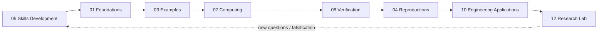

# Mathematics Mastery → Research System

<p align="center">
  
</p>

This module is the **learning-to-research control layer** of the Mathematics Research Ecosystem. It converts external courses, books, exercises, derivations, code, visualizations, and research questions into a traceable progression of mathematical competence.

The governing pipeline is

```math
\boxed{
\text{Learn}
\rightarrow
\text{Define}
\rightarrow
\text{Derive}
\rightarrow
\text{Prove}
\rightarrow
\text{Implement}
\rightarrow
\text{Verify}
\rightarrow
\text{Visualize}
\rightarrow
\text{Transfer}
\rightarrow
\text{Research}
}
```

The order is not cosmetic. Later stages may depend on earlier stages, but **no later artifact retroactively proves an earlier mathematical claim**.

## Scientific invariants

1. `WATCHED ≠ MASTERED`.
2. `COMPUTED ≠ PROVED`.
3. `PLOTTED ≠ VERIFIED`.
4. `BEAUTIFUL ≠ TRUE`.
5. `GEOMETRICALLY SUGGESTIVE ≠ DIFFERENTIAL-GEOMETRIC MODEL`.
6. `SOURCE-GROUNDED ≠ ORIGINAL`.
7. `NUMERICALLY STABLE ON A BENCHMARK ≠ EMPIRICALLY VALIDATED`.
8. `RESEARCH TRANSFER ≠ APPLICATION VALIDATION`.

A topic is promoted only through explicit evidence gates. The default maturity relation is

```math
L(\tau)\leq \min_{g\in\mathcal G(\tau)}L_g,
```

where `L(τ)` is the permitted mastery/research maturity of topic `τ` and `𝒢(τ)` is the set of required gates. The weakest required gate bounds the claim.

## Competency ladder

| Level | State | Required evidence |
|---|---|---|
| `L0` | Recognize | identify objects, notation, domains |
| `L1` | Understand | explain definitions, assumptions, geometric/statistical meaning |
| `L2` | Derive | reproduce key derivations independently |
| `L3` | Prove / solve | construct proofs or rigorous problem solutions where appropriate |
| `L4` | Implement / verify | tested symbolic or numerical implementation with diagnostics |
| `L5` | Generalize / research | formulate a defensible extension, conjecture, model, or bounded transfer |

No subject is globally marked “mastered.” Mastery is recorded **per competency and per mathematical object**.

## Subject architecture

The roadmap spans foundational mathematics through research mathematics:

```text
00 mathematical reasoning
01 college algebra
02 linear algebra
03 differential calculus
04 integral calculus
05 multivariable calculus
06 differential equations
07 probability
08 statistics
09 discrete mathematics
10 real analysis
11 advanced linear algebra
12 numerical analysis
13 optimization
14 graph theory
15 dynamical systems
16 stochastic processes
17 topology
18 differential geometry
19 Riemannian geometry
20 partial differential equations
21 control theory
22 viability theory
23 uncertainty quantification
24 research mathematics
```

The dependency order is governed by [`MATHEMATICS_DEPENDENCY_GRAPH.md`](MATHEMATICS_DEPENDENCY_GRAPH.md), not by folder numbering alone.

## Standard evidence loop

Every serious topic should eventually contain four linked surfaces:

```text
THEORY
├── definitions
├── assumptions
├── propositions/theorems
└── derivations/proofs

PROBLEMS
├── canonical exercises
├── counterexamples
├── limiting cases
└── independent solutions

COMPUTATION
├── symbolic implementation
├── numerical implementation
├── convergence/error analysis
└── regression tests

RESEARCH
├── literature provenance
├── bounded transfer hypothesis
├── falsification conditions
└── unresolved research questions
```

The minimum scientific loop is

```math
\boxed{
\text{Claim}
\rightarrow
\text{Assumptions}
\rightarrow
\text{Derivation / Source}
\rightarrow
\text{Independent Check}
\rightarrow
\text{Computation}
\rightarrow
\text{Verification}
\rightarrow
\text{Limits}
}
```

## Mathematics-art contract

Mathematical art in this module is a **scientific representation surface**. It must preserve:

- mathematical object identity;
- coordinate system and domain;
- topology where relevant;
- units where applicable;
- sign and orientation conventions;
- field values and normalization rules;
- evidence state;
- uncertainty or error when it materially affects interpretation.

The visual may change typography, camera, tessellation, line weight, animation, interaction, or color encoding. It may **not silently alter the mathematics**.

For a renderer `R` and mathematical object `M`, the required invariant is

```math
\boxed{
\mathcal S(M)=\mathcal S(R(M))
}
```

for the scientific semantics `𝒮`, unless the transformation is explicitly declared as an approximation or interpretive artwork.

## Core files

- [`MASTER_MATHEMATICS_ROADMAP.md`](MASTER_MATHEMATICS_ROADMAP.md) — staged curriculum from foundations to research.
- [`MATHEMATICS_DEPENDENCY_GRAPH.md`](MATHEMATICS_DEPENDENCY_GRAPH.md) — prerequisite DAG and dependency rules.
- [`MASTERY_STANDARD.md`](MASTERY_STANDARD.md) — non-compensatory promotion gates.
- [`templates/SUBJECT_TEMPLATE.md`](templates/SUBJECT_TEMPLATE.md) — required structure for every subject.
- [`progress/mastery_matrix.yaml`](progress/mastery_matrix.yaml) — machine-readable state registry.
- [`progress/competency_registry.json`](progress/competency_registry.json) — allowed competency/evidence vocabulary.
- [`../11_mathematics_literature_atlas/educational_sources/WQU_MATHEMATICS_FOUNDATION_RESOURCES_2024.md`](../11_mathematics_literature_atlas/educational_sources/WQU_MATHEMATICS_FOUNDATION_RESOURCES_2024.md) — source-provenance registry for the supplied WQU foundation resources.

## Relationship to the wider ecosystem



The purpose is not to collect more mathematics. The purpose is to build a **traceable scientific mechanism for becoming capable of doing mathematics and using it responsibly in research**.
